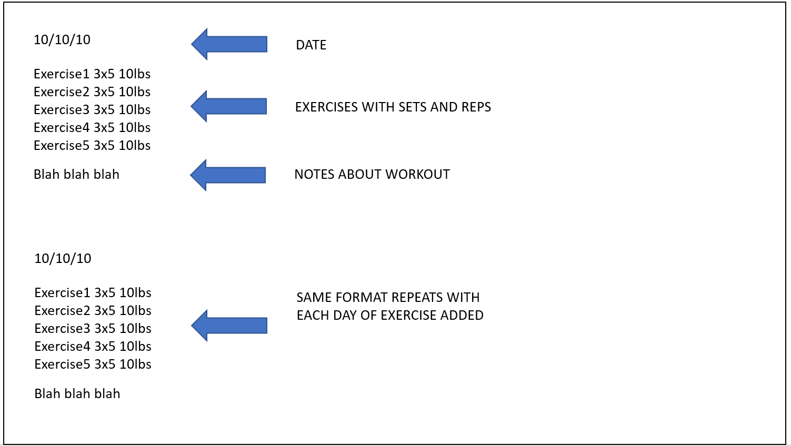
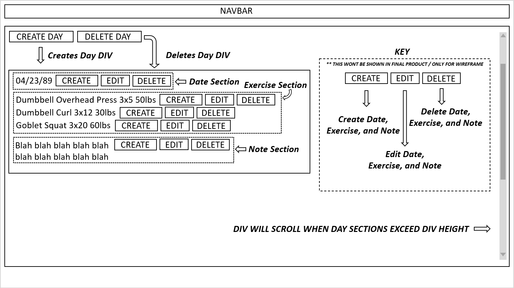

# Purpose of project

Have you ever gone to the gym and wanted to track down your progress?
This app will give you a notebook specifically for tracking your exercies.

# Link to deployed app

Deployed Front End (Surge): _http://clear-trouble.surge.sh/_

Deployed Back End (Heroku):

_Dates_  
Dates GET: _https://cryptic-thicket-90640.herokuapp.com/dates/_  
Dates POST: _https://cryptic-thicket-90640.herokuapp.com/dates/_  
{  
"day": 5,  
"month": 2,  
"year": 22  
}  
Dates PATCH: _https://cryptic-thicket-90640.herokuapp.com/dates/_  
{ 
"id": 1, <--- Add id of what you want to change 
"day": 55, 
"month": 2, 
"year": 22 
} 
Dates DELETE: _https://cryptic-thicket-90640.herokuapp.com/dates/x_ <--- (Change with ID)  

_Exercises_  
Exercises GET: _https://cryptic-thicket-90640.herokuapp.com/exercises/_  
Exercises POST: _https://cryptic-thicket-90640.herokuapp.com/exercises/_  
{ 
"exercise": "Conventional Deadlift",  
"sets": 1,  
"reps": 5,  
"weight": 235,  
"lborkg": "lb"  
} 
Exercises PATCH: _https://cryptic-thicket-90640.herokuapp.com/exercises/_  
{ 
"id": 1, <--- Add id of what you want to change 
"exercise": "Low Bar Squat", 
"sets": 5, 
"reps": 3, 
"weight": 190, 
"lborkg": "lb" 
} 
Exercises DELETE: _https://cryptic-thicket-90640.herokuapp.com/exercises/x_ <--- (Change with ID)  

_Notes_  
Notes GET: _https://cryptic-thicket-90640.herokuapp.com/notes/_  
Notes POST: _https://cryptic-thicket-90640.herokuapp.com/notes/_  
{ 
"note": "Hello, I am a note" 
} 
Notes PATCH: _https://cryptic-thicket-90640.herokuapp.com/notes/_  
{ 
"id": 1, <--- Add id of what you want to change 
"note": "Hello, I am also a note that's edited with patch" 
} 
Notes DELETE: _https://cryptic-thicket-90640.herokuapp.com/notes/x_ <--- (Change with ID)  

# Wireframe images

_Sorry for these scuffed wireframes, I'm not an artist_

_Wireframe v1_

_Wireframe v2_

